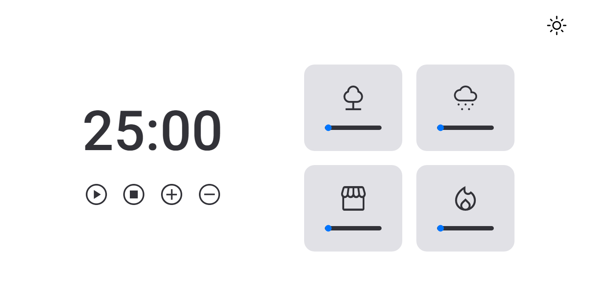
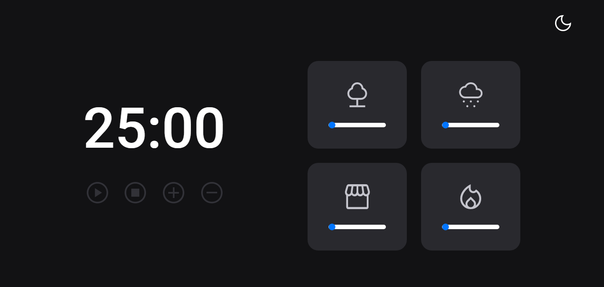

<h1 align="center"> FocusTimer 2.0 - Pomodoro </h1>

  <a href="#technologies">Technologies</a>&nbsp;&nbsp;&nbsp;|&nbsp;&nbsp;&nbsp;
  <a href="#project">Project</a>&nbsp;&nbsp;&nbsp;|&nbsp;&nbsp;&nbsp;
  <a href="#how-to-use">How to Use</a>&nbsp;&nbsp;&nbsp;|&nbsp;&nbsp;&nbsp;
  <a href="#files">Files</a>&nbsp;&nbsp;&nbsp;|&nbsp;&nbsp;&nbsp;
  <a href="#license">License</a>&nbsp;&nbsp;&nbsp;|&nbsp;&nbsp;&nbsp;
  <a href="#readme-in-portuguese">README in Portuguese</a>

  

 

  
  Light mode

 

  
  Dark mode

## Technologies

- HTML
- CSS
- JavaScript
- Git and GitHub
- Figma

## Project

This is a JavaScript project that implements a timer (Pomodoro-style) to increase productivity and focus, allowing periods of concentrated work interspersed with short breaks.

### Features
- Start
- Pause
- Stop
- Adjust
  - `+` adds 5 minutes
  - `-` subtracts 5 minutes
- Select ambient sounds to play
  - `forest`
  - `rain`
  - `coffee`
  - `fireplace`

## How to Use

To access the finished project, [click here](https://fernandoalvesrufino.github.io/focus-timer-2.0/).

## Files

The project is composed of the following files:
- `index.html`: HTML file that contains the structure of the application page. It includes references to the necessary CSS and JavaScript files, as well as the markup for the buttons and elements that make up the user interface.

- `style.css`: CSS file that contains the styling of the application page. It defines the positioning, size, and style of the elements, as well as the color scheme used.

- `index.js`: JavaScript file that contains the logic of the application. It creates instances of the Controls, Timer, Sound, and Events objects, and defines how they behave in response to user events.

- `controls.js`: JavaScript file that defines the Controls object, responsible for managing the logic of the "Play", "Pause", and "Stop" buttons.

- `timer.js`: JavaScript file that defines the Timer object, responsible for managing the timer and updating the user interface with the remaining time.

- `sounds.js`: JavaScript file that defines the Sound object, responsible for managing the ambient sounds that can be played during the timer.

- `events.js`: JavaScript file that defines the event functions used to handle user interactions with the application interface.

## License
This project is under the MIT license.

---

by Fernando Rufino

`Project created by Rocketseat`

# README in portuguese

<h1 align="center"> FocusTimer 2.0 - Pomodoro </h1>

  <a href="#tecnologias">Tecnologias</a>&nbsp;&nbsp;&nbsp;|&nbsp;&nbsp;&nbsp;
  <a href="#projeto">Projeto</a>&nbsp;&nbsp;&nbsp;|&nbsp;&nbsp;&nbsp;
  <a href="#como-usar">Como Usar</a>&nbsp;&nbsp;&nbsp;|&nbsp;&nbsp;&nbsp;
  <a href="#arquivos">Arquivos</a>&nbsp;&nbsp;&nbsp;|&nbsp;&nbsp;&nbsp;
  <a href="#licença">Licença</a>

  

 

  
  Light mode

 

  
  Dark mode

## Tecnologias

- HTML
- CSS
- JavaScript
- Git e GitHub
- Figma

## Projeto

Este é um projeto JavaScript que implementa um temporizador (estilo Pomodoro) para aumentar a produtividade e o foco, permitindo períodos de trabalho concentrado intercalados com pequenas pausas.

### Funcionalidades
- Iniciar
- Pausar
- Parar
- Ajustar
  - `+` adiciona 5 minutos
  - `-` retira 5 minutos
- Selecionar sons ambiente para tocar
  - `floresta`
  - `chuva`
  - `cafeteria`
  - `lareira`
- É possível ajustar o volume dos sons através do slider

## Como Usar

- Para acessar ao projeto finalizado, [clique aqui](https://fernandoalvesrufino.github.io/focus-timer-2.0/).

## Arquivos

O projeto é composto pelos seguintes arquivos:
- `index.html`: arquivo HTML que contém a estrutura da página do aplicativo. Ele inclui referências aos arquivos CSS e JavaScript necessários, bem como as marcações para os botões e elementos que compõem a interface do usuário.

- `style.css`: arquivo CSS que contém a estilização da página do aplicativo. Ele define o posicionamento, tamanho e estilo dos elementos, bem como o esquema de cores usado.

- `index.js`: arquivo JavaScript que contém a lógica do aplicativo. Ele cria instâncias dos objetos Controls, Timer, Sound e Events, e define como eles se comportam em resposta aos eventos do usuário.

- `controls.js`: arquivo JavaScript que define o objeto Controls, responsável por gerenciar a lógica dos botões "Play", "Pause", "Stop", "+" e "-".

- `timer.js`: arquivo JavaScript que define o objeto Timer, responsável por gerenciar o temporizador e atualizar a interface do usuário com o tempo restante.

- `sound.js`: arquivo JavaScript que define o objeto Sound, responsável por gerenciar os sons ambiente que podem ser tocados durante o temporizador.

- `events.js`: arquivo JavaScript que define as funções de evento usadas para lidar com as interações do usuário com a interface do aplicativo.

## Licença

Esse projeto está sob a licença MIT.

---

by Fernando Rufino

`Projeto criado pela Rocketseat`
